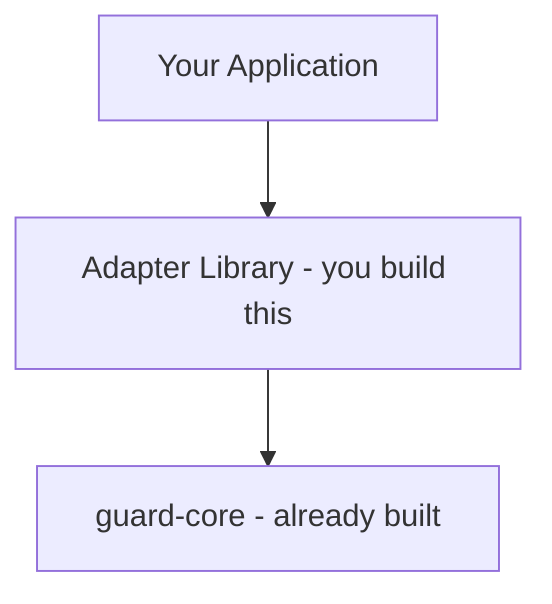

---

title: Building Adapters - Getting Started
description: How to build a framework-specific adapter library on top of guard-core, translating framework types to guard-core protocols.
keywords: guard-core, adapter development, framework integration, protocol implementation, middleware, security engine
---

# Building Adapters

## What Is an Adapter?

An adapter is a thin library that translates a web framework's native request/response types into the `GuardRequest` and `GuardResponse` protocols defined by `guard-core`. The adapter provides the glue between your framework (FastAPI, Flask, Django, or any other) and the security engine. All detection logic, rate limiting, IP management, behavioral tracking, cloud provider blocking, and pipeline orchestration live in `guard-core`. The adapter's only job is type translation and middleware wiring.



## Minimal Adapter Structure

A complete adapter package follows this layout:

```text
your-guard/
├── your_guard/
│   ├── __init__.py           # Public API exports
│   ├── middleware.py          # Framework middleware class
│   ├── request.py             # GuardRequest wrapper (if needed)
│   ├── response.py            # GuardResponse wrapper + factory
│   ├── utils.py               # Framework-specific utilities
│   ├── decorators/            # Re-export or extend guard-core decorators
│   │   └── __init__.py
│   ├── core/                  # Override or extend guard-core modules
│   │   ├── checks/
│   │   ├── responses/
│   │   ├── routing/
│   │   ├── bypass/
│   │   ├── behavioral/
│   │   ├── events/
│   │   ├── initialization/
│   │   └── validation/
│   └── handlers/              # Framework-specific handler overrides
├── tests/
├── pyproject.toml
└── setup.py
```

Not every directory is required. If `guard-core`'s default implementation works for your framework, you skip that module entirely. Most adapters only need:

- `middleware.py`
- `request.py` (or inline wrapper)
- `response.py` (or inline wrapper)

## What You Must Implement

### 1. GuardRequest Wrapper

A class that wraps your framework's request object and exposes the `GuardRequest` protocol:

```python
from guard_core.protocols.request_protocol import GuardRequest
```

The protocol requires these properties and methods:

| Member | Type | Purpose |
|---|---|---|
| `url_path` | `str` | Request path (e.g., `/api/users`) |
| `url_scheme` | `str` | `"http"` or `"https"` |
| `url_full` | `str` | Full URL including scheme, host, path |
| `url_replace_scheme(scheme)` | `str` | Return full URL with scheme replaced |
| `method` | `str` | HTTP method (`GET`, `POST`, etc.) |
| `client_host` | `str \| None` | Client IP address |
| `headers` | `Mapping[str, str]` | Request headers |
| `query_params` | `Mapping[str, str]` | Query string parameters |
| `body()` | `async -> bytes` | Request body as bytes |
| `state` | `Any` | Mutable namespace for inter-check data |
| `scope` | `dict[str, Any]` | ASGI-like scope dict (must contain `"app"` and `"route"`) |

### 2. GuardResponse Wrapper

A class wrapping your framework's response that exposes the `GuardResponse` protocol:

| Member | Type | Purpose |
|---|---|---|
| `status_code` | `int` | HTTP status code |
| `headers` | `MutableMapping[str, str]` | Response headers (must be mutable) |
| `body` | `bytes \| None` | Response body |

### 3. GuardResponseFactory

A factory that creates framework-native responses through the `GuardResponseFactory` protocol:

| Method | Signature | Purpose |
|---|---|---|
| `create_response` | `(content: str, status_code: int) -> GuardResponse` | Plain text error response |
| `create_redirect_response` | `(url: str, status_code: int) -> GuardResponse` | HTTP redirect |

### 4. Middleware Class

The middleware class that plugs into your framework's middleware stack and orchestrates the guard-core pipeline. This is where you:

- Initialize `SecurityConfig`, handlers, and the security pipeline
- Intercept incoming requests
- Wrap framework objects into `GuardRequest`/`GuardResponse`
- Run the `SecurityCheckPipeline`
- Return framework-native responses

## What You Get for Free

Everything inside `guard-core` works out of the box once you implement the four components above:

- **17 security checks** executing in a defined pipeline order (emergency mode, HTTPS enforcement, IP security, cloud provider blocking, rate limiting, suspicious activity detection, and more)
- **Attack detection engine** with pattern compilation, semantic analysis, anomaly detection, and performance monitoring
- **Rate limiting** with per-endpoint granularity, Redis-backed distributed counters, and Lua-script atomicity
- **IP ban management** with auto-ban thresholds, TTL-based expiry, and Redis persistence
- **Cloud provider IP blocking** for AWS, GCP, and Azure with automatic range refresh
- **Behavioral rule processing** for usage frequency tracking and return pattern detection
- **Security headers management** (HSTS, CSP, X-Frame-Options, etc.)
- **Event bus and metrics collection** for telemetry integration
- **Decorator system** for per-route configuration (`@guard.rate_limit()`, `@guard.require_ip()`, `@guard.block_clouds()`, etc.)
- **Dynamic rule management** via the Guard Agent platform
- **Passive mode** for logging without blocking

## Next Steps

| Page | What You Will Learn |
|---|---|
| [GuardRequest](guard-request.md) | Full protocol definition, property mapping table across frameworks, complete implementation example |
| [GuardResponse](guard-response.md) | Response protocol, factory implementation, how `ErrorResponseFactory` uses your factory |
| [Middleware Integration](middleware-integration.md) | The dispatch pattern, initialization sequence, real-world reference from fastapi-guard |
| [Decorators](decorators.md) | How guard-core's decorator system works, how adapters expose it, route resolution |
| [Testing](testing.md) | Mock objects, testing individual checks, integration testing patterns |
