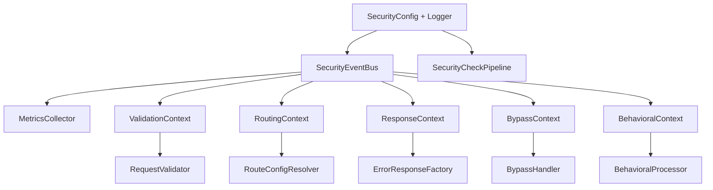
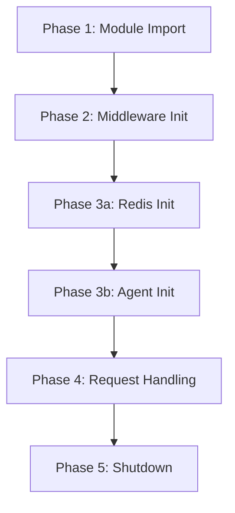

---

title: Dependency Injection - Guard Core
description: Context objects, HandlerInitializer wiring sequence, singleton handler lifecycle, and how adapters construct the guard-core dependency graph
keywords: guard-core, dependency injection, context objects, HandlerInitializer, singleton handlers, lifecycle
---

Dependency Injection
====================

guard-core uses a dependency injection pattern based on **typed context dataclasses**. Each core module receives its dependencies through a single context object, making dependencies explicit, testable, and decoupled from module internals.

---

Context Objects
---------------

Every major module in `guard_core/core/` has a corresponding context dataclass that bundles its dependencies. The adapter constructs these contexts during middleware initialization and passes them to module constructors.

### ResponseContext

**Location**: `guard_core/core/responses/context.py`

```python
from dataclasses import dataclass, field
from logging import Logger
from typing import Any

from guard_core.core.events import MetricsCollector
from guard_core.decorators.base import BaseSecurityDecorator
from guard_core.models import SecurityConfig


@dataclass
class ResponseContext:
    config: SecurityConfig
    logger: Logger
    metrics_collector: MetricsCollector

    agent_handler: Any | None = None
    guard_decorator: BaseSecurityDecorator | None = None
    response_factory: Any = field(default=None)
```

**Used by**: `ErrorResponseFactory`

| Field | Required | Description |
|---|---|---|
| `config` | Yes | The `SecurityConfig` instance |
| `logger` | Yes | Logger for error reporting |
| `metrics_collector` | Yes | The `MetricsCollector` instance for request metrics |
| `agent_handler` | No | Guard agent client (for client IP extraction in behavioral rules) |
| `guard_decorator` | No | The decorator handler (for behavioral rule processing) |
| `response_factory` | No | The adapter-provided `GuardResponseFactory` implementation |

!!! important "`response_factory` is the adapter's factory"
    `ResponseContext.response_factory` holds the adapter-provided `GuardResponseFactory` instance. `ErrorResponseFactory` delegates to this factory when it needs to create a framework-native response object.

### RoutingContext

**Location**: `guard_core/core/routing/context.py`

```python
from dataclasses import dataclass
from logging import Logger

from guard_core.decorators.base import BaseSecurityDecorator
from guard_core.models import SecurityConfig


@dataclass
class RoutingContext:
    config: SecurityConfig
    logger: Logger

    guard_decorator: BaseSecurityDecorator | None = None
```

**Used by**: `RouteConfigResolver`

| Field | Required | Description |
|---|---|---|
| `config` | Yes | The `SecurityConfig` instance |
| `logger` | Yes | Logger |
| `guard_decorator` | No | Fallback decorator handler when not found on the app instance |

### ValidationContext

**Location**: `guard_core/core/validation/context.py`

```python
from dataclasses import dataclass
from logging import Logger

from guard_core.core.events import SecurityEventBus
from guard_core.models import SecurityConfig


@dataclass
class ValidationContext:
    config: SecurityConfig
    logger: Logger
    event_bus: SecurityEventBus
```

**Used by**: `RequestValidator`

| Field | Required | Description |
|---|---|---|
| `config` | Yes | The `SecurityConfig` instance (for proxy trust settings and excluded paths) |
| `logger` | Yes | Logger for error reporting |
| `event_bus` | Yes | For emitting `path_excluded` events |

### BypassContext

**Location**: `guard_core/core/bypass/context.py`

```python
from dataclasses import dataclass
from logging import Logger

from guard_core.core.events import SecurityEventBus
from guard_core.core.responses import ErrorResponseFactory
from guard_core.core.routing import RouteConfigResolver
from guard_core.core.validation import RequestValidator
from guard_core.models import SecurityConfig


@dataclass
class BypassContext:
    config: SecurityConfig
    logger: Logger
    event_bus: SecurityEventBus
    route_resolver: RouteConfigResolver
    response_factory: ErrorResponseFactory
    validator: RequestValidator
```

**Used by**: `BypassHandler`

| Field | Required | Description |
|---|---|---|
| `config` | Yes | The `SecurityConfig` instance |
| `logger` | Yes | Logger |
| `event_bus` | Yes | For emitting `security_bypass` events |
| `route_resolver` | Yes | For checking `should_bypass_check("all", route_config)` |
| `response_factory` | Yes | For applying response modifiers to passthrough responses |
| `validator` | Yes | For `is_path_excluded()` checks |

### BehavioralContext

**Location**: `guard_core/core/behavioral/context.py`

```python
from dataclasses import dataclass
from logging import Logger

from guard_core.core.events import SecurityEventBus
from guard_core.decorators.base import BaseSecurityDecorator
from guard_core.models import SecurityConfig


@dataclass
class BehavioralContext:
    config: SecurityConfig
    logger: Logger
    event_bus: SecurityEventBus
    guard_decorator: BaseSecurityDecorator | None
```

**Used by**: `BehavioralProcessor`

| Field | Required | Description |
|---|---|---|
| `config` | Yes | The `SecurityConfig` instance |
| `logger` | Yes | Logger |
| `event_bus` | Yes | For emitting `decorator_violation` events on behavioral threshold breaches |
| `guard_decorator` | No | Required for behavioral tracking to function. When `None`, all behavioral processing is skipped |

---

Context Dependency Graph
------------------------

The contexts form a layered dependency graph. The adapter must construct them in bottom-up order:



### Construction Order in an Adapter

A typical adapter middleware `__init__` method constructs the dependency graph in this order:

```python
event_bus = SecurityEventBus(agent_handler, config, geo_ip_handler)
metrics_collector = MetricsCollector(agent_handler, config)

validation_ctx = ValidationContext(config, logger, event_bus)
validator = RequestValidator(validation_ctx)

routing_ctx = RoutingContext(config, logger, guard_decorator)
route_resolver = RouteConfigResolver(routing_ctx)

response_ctx = ResponseContext(
    config=config,
    logger=logger,
    metrics_collector=metrics_collector,
    agent_handler=agent_handler,
    guard_decorator=guard_decorator,
    response_factory=framework_response_factory,
)
error_response_factory = ErrorResponseFactory(response_ctx)

bypass_ctx = BypassContext(
    config=config,
    logger=logger,
    event_bus=event_bus,
    route_resolver=route_resolver,
    response_factory=error_response_factory,
    validator=validator,
)
bypass_handler = BypassHandler(bypass_ctx)

behavioral_ctx = BehavioralContext(config, logger, event_bus, guard_decorator)
behavioral_processor = BehavioralProcessor(behavioral_ctx)
```

---

HandlerInitializer
------------------

**Location**: `guard_core/core/initialization/handler_initializer.py`

`HandlerInitializer` orchestrates the async initialization of all singleton handlers. It is called during the adapter's middleware startup phase (typically in an ASGI lifespan handler or framework startup hook).

### Construction

```python
from guard_core.core.initialization import HandlerInitializer

initializer = HandlerInitializer(
    config=config,
    redis_handler=redis_handler,
    agent_handler=agent_handler,
    geo_ip_handler=geo_ip_handler,
    rate_limit_handler=rate_limit_handler,
    guard_decorator=guard_decorator,
)
```

| Parameter | Type | Description |
|---|---|---|
| `config` | `SecurityConfig` | The security configuration |
| `redis_handler` | `RedisHandlerProtocol \| None` | The Redis handler to wire into all handlers |
| `agent_handler` | `AgentHandlerProtocol \| None` | The guard-agent client |
| `geo_ip_handler` | `GeoIPHandler \| None` | The GeoIP handler |
| `rate_limit_handler` | `RateLimitManager \| None` | The rate limit handler |
| `guard_decorator` | `BaseSecurityDecorator \| None` | The decorator handler |

### Initialization Methods

#### `initialize_redis_handlers()`

Wires Redis into all handlers that need distributed state:

1. Calls `redis_handler.initialize()` to establish the Redis connection
2. If `config.block_cloud_providers` is set, initializes `cloud_handler` with Redis and the configured refresh interval
3. Initializes `ip_ban_manager` with Redis
4. Initializes `geo_ip_handler` with Redis (if provided)
5. Initializes `rate_limit_handler` with Redis (if provided)
6. Initializes `sus_patterns_handler` with Redis

```python
await initializer.initialize_redis_handlers()
```

!!! note "Guarded by config"
    This method returns immediately if `config.enable_redis` is `False` or `redis_handler` is `None`.

#### `initialize_agent_integrations()`

Wires the guard-agent into all handlers and starts the agent:

1. Calls `agent_handler.start()` to begin the agent's background flush loop
2. If Redis is available, wires Redis into the agent and vice versa
3. Calls `initialize_agent_for_handlers()` to wire the agent into `ip_ban_manager`, `rate_limit_handler`, `sus_patterns_handler`, `cloud_handler`, and `geo_ip_handler`
4. If `guard_decorator` has an `initialize_agent` method, wires the agent into it
5. Calls `initialize_dynamic_rule_manager()` if `config.enable_dynamic_rules` is enabled

```python
await initializer.initialize_agent_integrations()
```

!!! note "Guarded by agent_handler"
    This method returns immediately if `agent_handler` is `None`.

#### `initialize_agent_for_handlers()`

Internal method that wires the agent into individual handlers:

```python
await ip_ban_manager.initialize_agent(agent_handler)
await rate_limit_handler.initialize_agent(agent_handler)
await sus_patterns_handler.initialize_agent(agent_handler)
await cloud_handler.initialize_agent(agent_handler)
await geo_ip_handler.initialize_agent(agent_handler)
```

#### `initialize_dynamic_rule_manager()`

Sets up the `DynamicRuleManager` for polling rule updates from the agent platform:

1. Creates a `DynamicRuleManager(config)`
2. Wires the agent into it
3. Wires Redis into it (if available)

---

Singleton Handlers and Their Lifecycle
--------------------------------------

guard-core uses module-level singleton instances for stateful handlers. These singletons are imported by name throughout the codebase.

| Singleton | Module | Import |
|---|---|---|
| `redis_handler` | `guard_core.handlers.redis_handler` | `from guard_core import redis_handler` |
| `ip_ban_manager` | `guard_core.handlers.ipban_handler` | `from guard_core import ip_ban_manager` |
| `rate_limit_handler` | `guard_core.handlers.ratelimit_handler` | `from guard_core import rate_limit_handler` |
| `cloud_handler` | `guard_core.handlers.cloud_handler` | `from guard_core import cloud_handler` |
| `sus_patterns_handler` | `guard_core.handlers.suspatterns_handler` | `from guard_core import sus_patterns_handler` |
| `security_headers_manager` | `guard_core.handlers.security_headers_handler` | `from guard_core import security_headers_manager` |

### Lifecycle Phases



### Why Singletons?

Handlers manage shared state (ban lists, rate counters, cloud IP caches) that must be consistent across all requests within a process. Module-level singletons ensure:

- A single Redis connection pool per handler
- Consistent in-memory caches when Redis is unavailable
- No accidental duplication of state

!!! warning "Multi-process deployments"
    Singletons are per-process. In multi-worker deployments (e.g. Gunicorn with multiple workers), each worker has its own singleton instances. Redis is required for cross-process state consistency.

---

Putting It All Together
-----------------------

Here is a condensed example of how an adapter's middleware wires everything together:

```python
import logging
from guard_core.models import SecurityConfig
from guard_core.core.events import SecurityEventBus, MetricsCollector
from guard_core.core.initialization import HandlerInitializer
from guard_core.core.responses import ResponseContext, ErrorResponseFactory
from guard_core.core.routing import RoutingContext, RouteConfigResolver
from guard_core.core.validation import ValidationContext, RequestValidator
from guard_core.core.bypass import BypassContext, BypassHandler
from guard_core.core.behavioral import BehavioralContext, BehavioralProcessor
from guard_core.core.checks import SecurityCheckPipeline
from guard_core.core.checks import (
    RouteConfigCheck,
    EmergencyModeCheck,
    HttpsEnforcementCheck,
    RequestLoggingCheck,
    RequestSizeContentCheck,
    RequiredHeadersCheck,
    AuthenticationCheck,
    ReferrerCheck,
    CustomValidatorsCheck,
    TimeWindowCheck,
    CloudIpRefreshCheck,
    IpSecurityCheck,
    CloudProviderCheck,
    UserAgentCheck,
    RateLimitCheck,
    SuspiciousActivityCheck,
    CustomRequestCheck,
)


class MyAdapterMiddleware:
    def __init__(self, config: SecurityConfig):
        self.config = config
        self.logger = logging.getLogger("guard_core")

        self.event_bus = SecurityEventBus(None, config, config.geo_ip_handler)
        self.metrics_collector = MetricsCollector(None, config)

        validation_ctx = ValidationContext(config, self.logger, self.event_bus)
        self.validator = RequestValidator(validation_ctx)

        routing_ctx = RoutingContext(config, self.logger)
        self.route_resolver = RouteConfigResolver(routing_ctx)

        response_ctx = ResponseContext(
            config=config,
            logger=self.logger,
            metrics_collector=self.metrics_collector,
            response_factory=MyFrameworkResponseFactory(),
        )
        self.response_factory = ErrorResponseFactory(response_ctx)

        bypass_ctx = BypassContext(
            config=config,
            logger=self.logger,
            event_bus=self.event_bus,
            route_resolver=self.route_resolver,
            response_factory=self.response_factory,
            validator=self.validator,
        )
        self.bypass_handler = BypassHandler(bypass_ctx)

        behavioral_ctx = BehavioralContext(config, self.logger, self.event_bus, None)
        self.behavioral_processor = BehavioralProcessor(behavioral_ctx)

        self.pipeline = SecurityCheckPipeline([
            RouteConfigCheck(self),
            EmergencyModeCheck(self),
            HttpsEnforcementCheck(self),
            RequestLoggingCheck(self),
            RequestSizeContentCheck(self),
            RequiredHeadersCheck(self),
            AuthenticationCheck(self),
            ReferrerCheck(self),
            CustomValidatorsCheck(self),
            TimeWindowCheck(self),
            CloudIpRefreshCheck(self),
            IpSecurityCheck(self),
            CloudProviderCheck(self),
            UserAgentCheck(self),
            RateLimitCheck(self),
            SuspiciousActivityCheck(self),
            CustomRequestCheck(self),
        ])

    async def startup(self):
        initializer = HandlerInitializer(
            config=self.config,
            redis_handler=redis_handler_instance,
            agent_handler=agent_handler_instance,
            geo_ip_handler=self.config.geo_ip_handler,
            rate_limit_handler=rate_limit_handler_instance,
        )
        await initializer.initialize_redis_handlers()
        await initializer.initialize_agent_integrations()
```

!!! note "This is a simplified example"
    A real adapter also needs to implement `GuardMiddlewareProtocol`, handle the dispatch loop (passthrough, bypass, pipeline, behavioral, call_next, response processing), and manage the `GuardRequest` wrapping/unwrapping for the specific framework.
