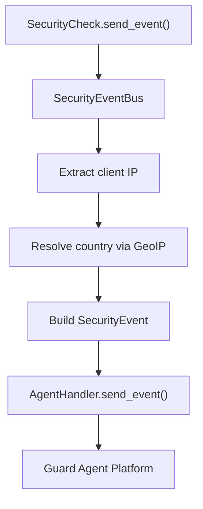

---

title: Event System - Guard Core
description: SecurityEventBus and MetricsCollector deep dive -- event types, metric types, agent integration, and how adapters hook into the event system
keywords: guard-core, events, SecurityEventBus, MetricsCollector, telemetry, security events, metrics
---

Event System
============

guard-core's event system provides two components: `SecurityEventBus` for dispatching security events and `MetricsCollector` for tracking request-level performance metrics. Both feed into the optional guard-agent telemetry platform.

**Location**: `guard_core/core/events/`

---

SecurityEventBus
----------------

**Location**: `guard_core/core/events/middleware_events.py`

The `SecurityEventBus` is responsible for constructing and dispatching `SecurityEvent` objects to the guard-agent handler. It is the central point through which all security checks, bypass handlers, and validation logic report what happened to a request.

### Construction

```python
from guard_core.core.events import SecurityEventBus

event_bus = SecurityEventBus(
    agent_handler=agent_handler,
    config=config,
    geo_ip_handler=geo_ip_handler,
)
```

| Parameter | Type | Description |
|---|---|---|
| `agent_handler` | `AgentHandlerProtocol \| None` | The guard-agent client. When `None`, all event methods become no-ops |
| `config` | `SecurityConfig` | Used to check `config.agent_enable_events` and to extract client IPs |
| `geo_ip_handler` | `GeoIPHandler \| None` | Used to resolve client IP to country code for event enrichment |

### Core Method: `send_middleware_event`

```python
async def send_middleware_event(
    self,
    event_type: str,
    request: GuardRequest,
    action_taken: str,
    reason: str,
    **kwargs: Any,
) -> None
```

This is the primary method called by security checks and internal components. It:

1. Returns immediately if `agent_handler` is `None` or `config.agent_enable_events` is `False`
2. Extracts the client IP from the request (respecting proxy configuration)
3. Resolves the client's country via `geo_ip_handler.get_country()` (if available)
4. Constructs a `SecurityEvent` with timestamp, event type, IP, country, user agent, action, reason, endpoint, method, and any additional metadata from `**kwargs`
5. Sends the event to the agent via `agent_handler.send_event()`

### Event Types

These are the `event_type` strings used throughout guard-core:

| Event Type | Emitted By | Description |
|---|---|---|
| `emergency_mode_block` | `EmergencyModeCheck` | Request blocked during emergency lockdown |
| `https_enforced` | `SecurityEventBus.send_https_violation_event` | HTTP request redirected to HTTPS (global config) |
| `decorator_violation` | Multiple checks | Route-level security rule violated (generic) |
| `ip_blocked` | `IpSecurityCheck` | IP blocked by global allowlist/blocklist |
| `path_excluded` | `RequestValidator.is_path_excluded` | Request path excluded from security checks |
| `security_bypass` | `BypassHandler` | Route configured to bypass all checks |
| `dynamic_rule_violation` | `RateLimitCheck` | Endpoint-specific rate limit (from dynamic rules) exceeded |
| `access_denied` | `BaseSecurityDecorator` | Decorator-level access denial |
| `authentication_failed` | `BaseSecurityDecorator` | Authentication check failed |
| `rate_limited` | `BaseSecurityDecorator` | Decorator-level rate limit exceeded |

### Specialized Event Methods

#### `send_https_violation_event`

```python
async def send_https_violation_event(
    self, request: GuardRequest, route_config: RouteConfig | None
) -> None
```

Dispatches either a `decorator_violation` event (when the route specifically requires HTTPS via decorator) or an `https_enforced` event (when global HTTPS enforcement is active). Includes the original scheme and redirect URL in the event metadata.

#### `send_cloud_detection_events`

```python
async def send_cloud_detection_events(
    self,
    request: GuardRequest,
    client_ip: str,
    cloud_providers_to_check: list[str],
    route_config: RouteConfig | None,
    cloud_handler: Any,
    passive_mode: bool,
) -> None
```

Dispatches cloud provider detection events. Resolves which specific cloud provider and network the IP belongs to, then emits events both from the cloud handler (with provider details) and from the event bus (with decorator violation metadata if applicable).

### Event Payload Structure

Each event sent to the agent is a `SecurityEvent` object (from `guard_agent`) with these fields:

| Field | Type | Source |
|---|---|---|
| `timestamp` | `datetime` | `datetime.now(timezone.utc)` |
| `event_type` | `str` | The `event_type` parameter |
| `ip_address` | `str` | Extracted from request (proxy-aware) |
| `country` | `str \| None` | From `geo_ip_handler.get_country()` |
| `user_agent` | `str \| None` | From `request.headers.get("User-Agent")` |
| `action_taken` | `str` | e.g. `"request_blocked"`, `"logged_only"`, `"https_redirect"` |
| `reason` | `str` | Human-readable reason string |
| `endpoint` | `str` | `request.url_path` |
| `method` | `str` | `request.method` |
| `metadata` | `dict` | All additional `**kwargs` |

---

MetricsCollector
----------------

**Location**: `guard_core/core/events/metrics.py`

The `MetricsCollector` tracks per-request performance metrics and sends them to the guard-agent platform.

### Construction

```python
from guard_core.core.events import MetricsCollector

metrics = MetricsCollector(
    agent_handler=agent_handler,
    config=config,
)
```

| Parameter | Type | Description |
|---|---|---|
| `agent_handler` | `AgentHandlerProtocol \| None` | The guard-agent client. When `None`, all metric methods become no-ops |
| `config` | `SecurityConfig` | Used to check `config.agent_enable_metrics` |

### Core Method: `send_metric`

```python
async def send_metric(
    self, metric_type: str, value: float, tags: dict[str, str] | None = None
) -> None
```

Constructs a `SecurityMetric` object and sends it to the agent. No-ops when agent is disabled or `config.agent_enable_metrics` is `False`.

### Request Metrics: `collect_request_metrics`

```python
async def collect_request_metrics(
    self, request: GuardRequest, response_time: float, status_code: int
) -> None
```

Called by `ErrorResponseFactory.process_response()` after the request handler completes. Emits three metrics:

| Metric Type | Value | Tags |
|---|---|---|
| `response_time` | Response time in seconds | `endpoint`, `method`, `status` |
| `request_count` | `1.0` | `endpoint`, `method` |
| `error_rate` | `1.0` (only for 4xx/5xx) | `endpoint`, `method`, `status` |

---

How Adapters Hook Into Events
-----------------------------

### Using the Event Bus Directly

Your adapter's middleware can use the event bus to emit custom events:

```python
await self.event_bus.send_middleware_event(
    event_type="custom_adapter_event",
    request=request,
    action_taken="logged",
    reason="Custom event from adapter",
    custom_field="custom_value",
)
```

### Using the Metrics Collector Directly

```python
await self.metrics_collector.send_metric(
    metric_type="custom_metric",
    value=42.0,
    tags={"source": "adapter", "operation": "transform"},
)
```

### Event Flow Diagram



### Disabling Events and Metrics

Events and metrics can be independently controlled through `SecurityConfig`:

| Config Field | Default | Effect When `False` |
|---|---|---|
| `agent_enable_events` | `True` | `send_middleware_event()` becomes a no-op |
| `agent_enable_metrics` | `True` | `send_metric()` and `collect_request_metrics()` become no-ops |
| `enable_agent` | `False` | No agent handler is created; both events and metrics are disabled |

!!! note "No-agent behavior"
    When `enable_agent = False` (the default), `agent_handler` is `None`. Both `SecurityEventBus` and `MetricsCollector` check for `None` at the top of every method and return immediately. There is zero overhead when the agent is disabled.
