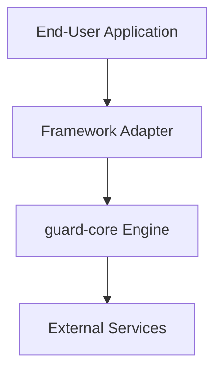
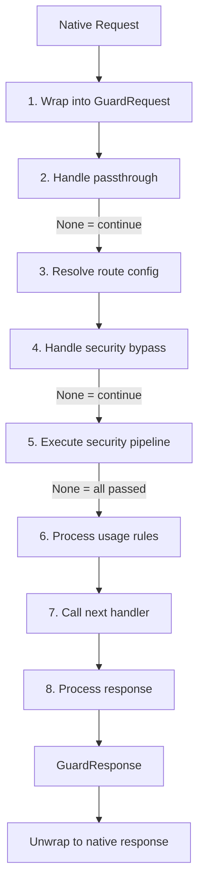

---

title: Architecture Overview - Guard Core
description: Deep technical overview of guard-core's modular architecture, request lifecycle, module map, and design principles for adapter developers
keywords: guard-core, architecture, module map, request lifecycle, design principles, dependency injection, security engine
---

Architecture Overview
=====================

guard-core is a framework-agnostic security engine. Adapter libraries (fastapi-guard, flaskapi-guard, djapi-guard) bridge their framework's native request/response types into guard-core's protocol contracts, then delegate all security logic to the engine.

This document covers the ecosystem architecture, module map, request lifecycle, and the design principles that govern how everything fits together.

___

Ecosystem Architecture
----------------------



The adapter is the **only layer** that knows about the web framework. guard-core never imports FastAPI, Flask, Django, or any other framework.

___

Module Map
----------

### `guard_core/protocols/`

The contract layer. All types here are `typing.Protocol` classes decorated with `@runtime_checkable`.

| Module | Protocol | Purpose |
|---|---|---|
| `request_protocol.py` | `GuardRequest` | Abstraction over native HTTP request objects |
| `response_protocol.py` | `GuardResponse` | Abstraction over native HTTP response objects |
| `response_protocol.py` | `GuardResponseFactory` | Factory for creating response objects |
| `middleware_protocol.py` | `GuardMiddlewareProtocol` | What the middleware instance must expose to checks |
| `geo_ip_protocol.py` | `GeoIPHandler` | GeoIP lookup interface |
| `redis_protocol.py` | `RedisHandlerProtocol` | Redis operations interface |
| `agent_protocol.py` | `AgentHandlerProtocol` | Telemetry agent interface |

### `guard_core/core/`

The engine internals, organized into 8 sub-modules:

| Sub-module | Components | Responsibility |
|---|---|---|
| `checks/` | `SecurityCheck`, `SecurityCheckPipeline`, 17 check implementations | Chain-of-responsibility security pipeline |
| `events/` | `SecurityEventBus`, `MetricsCollector` | Event dispatching and metrics collection |
| `initialization/` | `HandlerInitializer` | Redis, agent, and handler wiring |
| `responses/` | `ErrorResponseFactory`, `ResponseContext` | Error responses, HTTPS redirects, security headers, CORS |
| `routing/` | `RouteConfigResolver`, `RoutingContext` | Route-level configuration and decorator resolution |
| `validation/` | `RequestValidator`, `ValidationContext` | HTTPS detection, proxy trust, time windows, path exclusion |
| `bypass/` | `BypassHandler`, `BypassContext` | Passthrough and security bypass cases |
| `behavioral/` | `BehavioralProcessor`, `BehavioralContext` | Usage tracking and return-pattern behavioral rules |

### `guard_core/handlers/`

Singleton handler instances that manage stateful operations:

| Handler | Singleton | Purpose |
|---|---|---|
| `redis_handler.py` | `redis_handler` | Redis connection management |
| `ipban_handler.py` | `ip_ban_manager` | IP ban storage and lookup |
| `ratelimit_handler.py` | `rate_limit_handler` | Rate limit tracking |
| `cloud_handler.py` | `cloud_handler` | Cloud provider IP range management |
| `suspatterns_handler.py` | `sus_patterns_handler` | Suspicious pattern tracking and auto-ban |
| `security_headers_handler.py` | `security_headers_manager` | Security header generation |
| `ipinfo_handler.py` | `IPInfoManager` | IPInfo-based GeoIP lookups |
| `behavior_handler.py` | `BehaviorTracker` | Behavioral rule state tracking |
| `dynamic_rule_handler.py` | `DynamicRuleManager` | Dynamic rule updates from agent |

### `guard_core/detection_engine/`

Regex-based and semantic attack pattern detection. Configurable through `SecurityConfig` fields prefixed with `detection_`.

### `guard_core/decorators/`

`BaseSecurityDecorator` and `RouteConfig` provide route-level security configuration. Framework-specific adapters extend `BaseSecurityDecorator` to create decorator APIs native to their framework.

### `guard_core/models.py`

`SecurityConfig` (Pydantic `BaseModel`) is the single configuration object for the entire engine. `DynamicRules` defines the shape of runtime rule updates from the guard-agent platform.

___

Request Lifecycle
-----------------

This is the complete path a request takes through the engine, from the adapter's perspective:



!!! important "The adapter orchestrates this flow"
    guard-core provides all the components listed above, but the **adapter's middleware class** is responsible for calling them in the correct order. guard-core does not impose a middleware base class -- it provides building blocks.

___

Design Principles
-----------------

### Protocol-Based Contracts

Every boundary between guard-core and the outside world is defined by a `typing.Protocol`. This means:

- guard-core never imports framework-specific code
- Adapters satisfy protocols through structural subtyping (duck typing with type safety)
- All protocols are `@runtime_checkable`, so `isinstance()` checks work at runtime

### Dependency Injection via Context Objects

Each core module receives its dependencies through a `@dataclass` context object rather than through constructor parameters or global state:

```python
@dataclass
class ResponseContext:
    config: SecurityConfig
    logger: Logger
    metrics_collector: MetricsCollector
    agent_handler: Any | None = None
    guard_decorator: BaseSecurityDecorator | None = None
    response_factory: Any = field(default=None)
```

The adapter constructs these context objects during middleware initialization and passes them to the respective module constructors. This keeps module interfaces explicit and testable.

### Singleton Handlers

Stateful handlers (`ip_ban_manager`, `cloud_handler`, `rate_limit_handler`, `sus_patterns_handler`, `redis_handler`, `security_headers_manager`) are module-level singletons. They are initialized asynchronously through `HandlerInitializer` during the middleware's startup phase:

1. `initialize_redis_handlers()` -- connects Redis and wires it into all handlers
2. `initialize_agent_integrations()` -- starts the agent and wires it into all handlers
3. `initialize_dynamic_rule_manager()` -- sets up dynamic rule polling (if enabled)

### Chain of Responsibility

The `SecurityCheckPipeline` iterates over an ordered list of `SecurityCheck` instances. Each check either returns `None` (pass) or a `GuardResponse` (block). The pipeline short-circuits on the first blocking response.

### Passive Mode

When `SecurityConfig.passive_mode = True`, checks log violations but return `None` instead of blocking responses. This allows deploying guard-core in observation mode before enforcing.

### Fail-Open by Default

If a security check raises an exception, the pipeline logs the error and continues to the next check (fail-open). Adapters can opt into fail-secure behavior by setting a `fail_secure` attribute on the config (not a standard `SecurityConfig` field — checked via `hasattr`).
