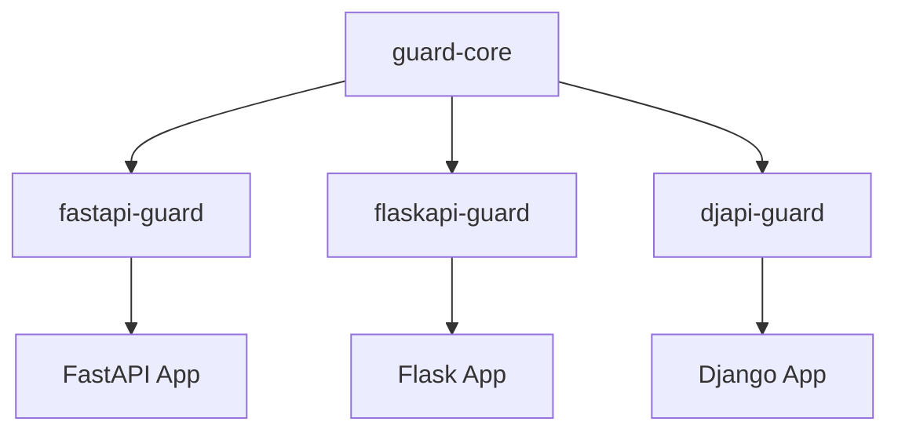

---

title: Guard Core - Framework-Agnostic Security Engine for Python
description: The protocol-based security engine that powers framework-specific adapters like fastapi-guard, flaskapi-guard, and djapi-guard
keywords: guard-core, security engine, python, protocol-based, adapter development, middleware engine
---

Guard Core
==========


[](https://badge.fury.io/py/guard-core)
[](https://github.com/rennf93/guard-core/actions/workflows/release.yml)
[](https://opensource.org/licenses/MIT)
[](https://github.com/rennf93/guard-core/actions/workflows/ci.yml)
[](https://github.com/rennf93/guard-core/actions/workflows/code-ql.yml)

`guard-core` is the **framework-agnostic security engine** that provides IP control, rate limiting, penetration detection, security headers, and behavioral analysis through a protocol-based architecture. It is designed to be consumed by **framework-specific adapters** -- not directly by end users.



Adapter developers implement three protocols -- `GuardRequest`, `GuardResponse`, and `GuardResponseFactory` -- to bridge their framework's native objects into `guard-core`'s security pipeline. Everything else (17 security checks, the detection engine, Redis state management, event telemetry) works out of the box.

___

Key Design Properties
---------------------

- **Protocol-based contracts**: `GuardRequest`, `GuardResponse`, and `GuardResponseFactory` are `typing.Protocol` classes with `@runtime_checkable`. Your adapter implements them; guard-core consumes them.
- **17 security checks in a chain-of-responsibility pipeline**: Each check is an independent `SecurityCheck` subclass. The `SecurityCheckPipeline` executes them in order and short-circuits on the first blocking response.
- **Dependency injection via context dataclasses**: Every core module receives its dependencies through a typed context object (`ResponseContext`, `RoutingContext`, `ValidationContext`, `BypassContext`, `BehavioralContext`).
- **Singleton handlers with async initialization**: `ip_ban_manager`, `cloud_handler`, `rate_limit_handler`, `sus_patterns_handler`, and `redis_handler` are module-level singletons initialized through `HandlerInitializer`.
- **Detection engine**: Regex-based and semantic attack pattern detection with configurable thresholds, timeouts, and content length limits.
- **Redis-backed distributed state**: Rate limits, IP bans, cloud IP ranges, and suspicious pattern counts persist across instances when Redis is enabled. Falls back to in-memory storage automatically.
- **Event system**: `SecurityEventBus` dispatches security events and `MetricsCollector` tracks request metrics, both feeding into the optional guard-agent telemetry platform.

___

Install
-------

```bash
pip install guard-core
```

!!! info "Python 3.10+"
    guard-core requires Python 3.10 or higher.

___

Documentation
-------------

### For Adapter Developers

- [Installation and Dev Setup](installation.md) -- how to depend on guard-core and set up a contributor environment
- [Architecture Overview](architecture/overview.md) -- module map, request lifecycle, design principles
- [Protocol Reference](architecture/protocols.md) -- `GuardRequest`, `GuardResponse`, `GuardResponseFactory`, `GuardMiddlewareProtocol`
- [Security Pipeline](architecture/pipeline.md) -- `SecurityCheckPipeline`, all 17 checks, adding custom checks
- [Event System](architecture/events.md) -- `SecurityEventBus`, `MetricsCollector`, hooking into events
- [Dependency Injection](architecture/dependency-injection.md) -- context objects, `HandlerInitializer`, singleton lifecycle

### API Reference

- [Models](api/models.md)
- [Protocols](api/protocols.md)
- [Handlers](api/handlers.md)
- [Decorators](api/decorators.md)
- [Utilities](api/utilities.md)
