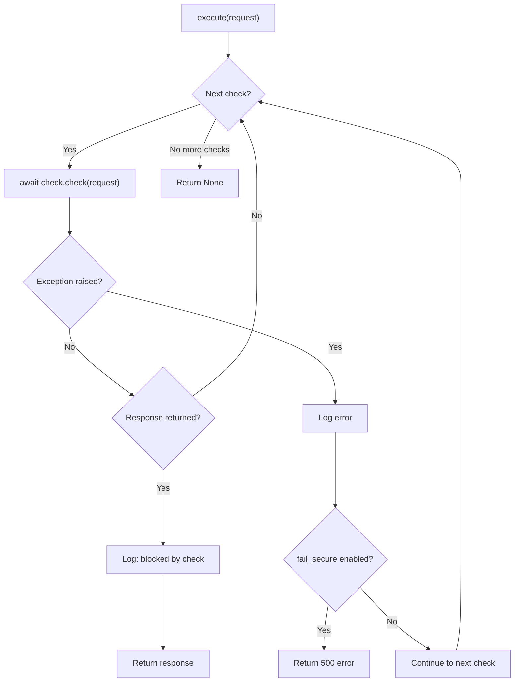

---

title: Security Checks Framework
description: SecurityCheck base class, SecurityCheckPipeline, and helper functions for building custom security checks in guard-core
keywords: security checks, pipeline, chain of responsibility, guard-core, adapter development
---

# Security Checks Framework

The security checks framework is the backbone of guard-core's request processing. It implements a Chain of Responsibility pattern where each check runs in sequence, and the first check to return a non-`None` response terminates the pipeline.

## SecurityCheck Base Class

::: guard_core.core.checks.base.SecurityCheck

All security checks inherit from the abstract `SecurityCheck` class, which provides a consistent interface and shared utilities.

```python
from abc import ABC, abstractmethod
from guard_core.protocols.request_protocol import GuardRequest
from guard_core.protocols.response_protocol import GuardResponse

class SecurityCheck(ABC):
    def __init__(self, middleware: "GuardMiddlewareProtocol") -> None:
        self.middleware = middleware
        self.config = middleware.config
        self.logger = middleware.logger

    @abstractmethod
    async def check(self, request: GuardRequest) -> GuardResponse | None: ...

    @property
    @abstractmethod
    def check_name(self) -> str: ...

    async def send_event(
        self, event_type: str, request: GuardRequest,
        action_taken: str, reason: str, **kwargs
    ) -> None: ...

    async def create_error_response(
        self, status_code: int, default_message: str
    ) -> GuardResponse: ...

    def is_passive_mode(self) -> bool: ...
```

### Constructor

The constructor receives a `GuardMiddlewareProtocol` instance and extracts `config` and `logger` from it. Adapter developers do not call this directly -- the middleware builds check instances during pipeline construction.

| Attribute    | Type                     | Source                |
|--------------|--------------------------|-----------------------|
| `middleware` | `GuardMiddlewareProtocol`| Passed to constructor |
| `config`     | `SecurityConfig`         | `middleware.config`   |
| `logger`     | `logging.Logger`         | `middleware.logger`   |

### Abstract Members

**`check(request) -> GuardResponse | None`**

The core method every check must implement. Returns `None` to pass the request to the next check, or a `GuardResponse` to block and respond immediately.

**`check_name -> str`**

A read-only property returning a unique string identifier for the check. Used in logging, pipeline management, and the `remove_check` method.

### Utility Methods

**`send_event(event_type, request, action_taken, reason, **kwargs)`**

Delegates to `middleware.event_bus.send_middleware_event()`. Adapter developers should use this for audit trail events rather than calling the event bus directly.

**`create_error_response(status_code, default_message)`**

Delegates to `middleware.create_error_response()`. The middleware implementation consults `SecurityConfig.custom_error_responses` for message overrides before creating the response via the adapter's `GuardResponseFactory`.

**`is_passive_mode()`**

Returns `self.config.passive_mode`. When passive mode is active, checks should log and emit events but not block requests.

## SecurityCheckPipeline

::: guard_core.core.checks.pipeline.SecurityCheckPipeline

The pipeline holds an ordered list of `SecurityCheck` instances and executes them sequentially.

```python
class SecurityCheckPipeline:
    def __init__(self, checks: list[SecurityCheck]) -> None: ...
    async def execute(self, request: GuardRequest) -> GuardResponse | None: ...
    def add_check(self, check: SecurityCheck) -> None: ...
    def insert_check(self, index: int, check: SecurityCheck) -> None: ...
    def remove_check(self, check_name: str) -> bool: ...
    def get_check_names(self) -> list[str]: ...
```

### Execution Flow



### Error Handling

When a check raises an exception:

- The error is logged with `exc_info=True` for full traceback.
- If `config.fail_secure` is set (opt-in, not a standard `SecurityConfig` field — use `hasattr`), the pipeline returns a `500` error response (fail-closed behavior).
- Otherwise, the pipeline continues to the next check (fail-open behavior).

### Pipeline Manipulation

Adapters can modify the pipeline after construction:

| Method                          | Description                                              |
|---------------------------------|----------------------------------------------------------|
| `add_check(check)`             | Appends a check to the end of the pipeline               |
| `insert_check(index, check)`   | Inserts a check at a specific position                   |
| `remove_check(check_name)`     | Removes the first check matching the name; returns `bool`|
| `get_check_names()`            | Returns the ordered list of check name strings           |
| `len(pipeline)`                | Returns the number of checks                             |

!!! warning "Order Matters"
    Inserting checks at the wrong position can break assumptions. For example, `RouteConfigCheck` must run first because all subsequent checks read `request.state.route_config` and `request.state.client_ip`, which it populates.

## Helper Functions

::: guard_core.core.checks.helpers

Helper functions are stateless utilities shared across check implementations.

### IP Access Helpers

**`is_ip_in_blacklist(client_ip, ip_addr, blacklist) -> bool`**

Checks whether `client_ip` appears in a list of blocked IPs or CIDR ranges.

**`is_ip_in_whitelist(client_ip, ip_addr, whitelist) -> bool | None`**

Returns `True` if allowed, `False` if explicitly not in the whitelist, or `None` if the whitelist is empty (no opinion).

**`check_country_access(client_ip, route_config, geo_ip_handler) -> bool | None`**

Evaluates country-based rules on a `RouteConfig`. Returns `False` to block, `True` to allow, `None` for no opinion.

**`check_route_ip_access(client_ip, route_config, middleware) -> bool | None`**

Combines blacklist, whitelist, and country checks for a route-level IP evaluation. Returns `False` on any deny condition.

### User Agent Helpers

**`check_user_agent_allowed(user_agent, route_config, config) -> bool`**

Checks the user agent against both route-level `blocked_user_agents` and the global `config.blocked_user_agents` list. Uses case-insensitive regex matching.

### Authentication Helpers

**`validate_auth_header(auth_header, auth_type) -> tuple[bool, str]`**

Validates that an `Authorization` header has the correct prefix for the specified type (`"bearer"`, `"basic"`, or custom). Returns `(True, "")` on success or `(False, reason)` on failure.

### Referrer Helpers

**`is_referrer_domain_allowed(referrer, allowed_domains) -> bool`**

Parses the referrer URL and checks the domain against a list. Supports subdomain matching (e.g., `sub.example.com` matches `example.com`).

### Penetration Detection Helpers

**`detect_penetration_patterns(request, route_config, config, should_bypass_check_fn) -> tuple[bool, str]`**

Orchestrates the penetration detection check. Respects decorator-level overrides and bypass configuration. Returns `(True, trigger_info)` when a threat is detected, or `(False, reason)` when skipped or clean.
