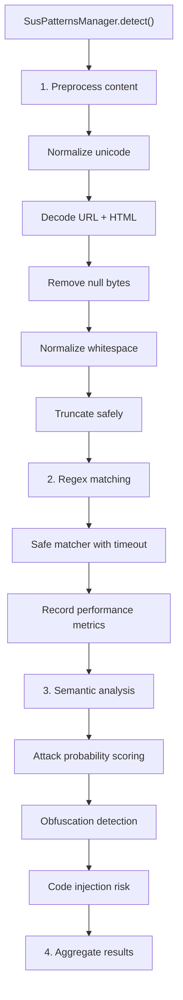

---

title: Detection Engine
description: PatternCompiler, ContentPreprocessor, SemanticAnalyzer, and PerformanceMonitor internals for guard-core's threat detection
keywords: detection engine, pattern matching, semantic analysis, performance monitoring, guard-core
---

Detection Engine
================

The detection engine (`guard_core.detection_engine`) provides multi-layered threat detection with four components working together: pattern compilation, content preprocessing, semantic analysis, and performance monitoring.

These components are orchestrated by the `SusPatternsManager` handler, which adapter developers do not call directly but may need to understand for tuning and diagnostics.

Architecture
------------



___

PatternCompiler
---------------

Manages regex pattern compilation with LRU caching and ReDoS safety validation.

### Constructor

```python
PatternCompiler(default_timeout: float = 5.0, max_cache_size: int = 1000)
```

| Parameter         | Description                                        | Bounds          |
|-------------------|----------------------------------------------------|-----------------|
| `default_timeout` | Timeout for safe matchers in seconds               | N/A             |
| `max_cache_size`  | Maximum compiled patterns to cache                 | Capped at 5000  |

### Key Methods

**`compile_pattern(pattern, flags) -> re.Pattern`** (async)

Thread-safe compilation with LRU eviction. Cache key is `f"{hash(pattern)}:{flags}"`.

**`compile_pattern_sync(pattern, flags) -> re.Pattern`**

Synchronous compilation without caching. Used internally by validators and safe matchers.

**`validate_pattern_safety(pattern, test_strings) -> tuple[bool, str]`**

Validates a pattern against ReDoS vulnerability:

1. Checks for known dangerous constructs: `(.*)+`, `(.+)+`, nested quantifiers.
2. Runs the pattern against test strings (default: varying lengths of `'a'`, `'x'+'y'`, `'<'+'>'`) with a 100ms timeout per string.
3. If any test exceeds 50ms, the pattern is flagged as unsafe.

**`create_safe_matcher(pattern, timeout) -> Callable[[str], Match | None]`**

Returns a closure that executes the regex in a thread pool with a timeout. If the match exceeds the timeout, the future is cancelled and `None` is returned.

```python
safe_match = compiler.create_safe_matcher(r"<script.*?>", timeout=2.0)
result = safe_match(user_input)  # None if timed out
```

**`batch_compile(patterns, validate) -> dict[str, re.Pattern]`** (async)

Compiles multiple patterns, optionally validating each for safety. Unsafe or invalid patterns are silently skipped.

___

ContentPreprocessor
-------------------

Normalizes and sanitizes input before pattern matching.

### Constructor

```python
ContentPreprocessor(
    max_content_length: int = 10000,
    preserve_attack_patterns: bool = True,
    agent_handler: Any = None,
    correlation_id: str | None = None,
)
```

### Preprocessing Pipeline

The `preprocess()` method runs five stages in order:

| Stage                       | Method                      | Purpose                                          |
|-----------------------------|-----------------------------|--------------------------------------------------|
| Unicode normalization       | `normalize_unicode()`       | NFKC normalization + lookalike character replacement |
| Encoding detection          | `decode_common_encodings()` | URL decode + HTML entity decode (up to 3 iterations) |
| Null byte removal           | `remove_null_bytes()`       | Strips `\x00` and control characters except tab/newline/CR |
| Whitespace normalization    | `remove_excessive_whitespace()` | Collapses multiple spaces, strips leading/trailing |
| Safe truncation             | `truncate_safely()`         | Truncates to `max_content_length` preserving attack regions |

### Attack-Preserving Truncation

When content exceeds `max_content_length` and `preserve_attack_patterns` is `True`:

1. `extract_attack_regions()` scans for 21 attack indicator patterns (e.g., `<script`, `SELECT ... FROM`, `eval(`, `../`).
2. Regions around matches (100 characters of context on each side) are extracted.
3. Overlapping regions are merged.
4. Attack regions are included first, then non-attack content fills remaining space.

This ensures that truncated content still contains the attack patterns for detection.

### Unicode Lookalike Map

The preprocessor replaces over 20 Unicode characters used for evasion:

| Unicode     | Replacement | Purpose                      |
|-------------|-------------|------------------------------|
| `\u2044`    | `/`         | Fraction slash evasion       |
| `\uff0f`    | `/`         | Fullwidth solidus            |
| `\u200b`    | (empty)     | Zero-width space             |
| `\uff1c`    | `<`         | Fullwidth less-than          |
| `\uff1e`    | `>`         | Fullwidth greater-than       |
| `\u037e`    | `;`         | Greek question mark          |

___

SemanticAnalyzer
----------------

Performs structural and statistical analysis of content to detect attacks that evade pattern matching.

### Attack Probability Analysis

```python
def analyze_attack_probability(self, content: str) -> dict[str, float]
```

Returns a dictionary mapping attack types to probability scores (0.0 - 1.0):

| Attack Type  | Keywords Checked                                              | Structural Boost |
|-------------|---------------------------------------------------------------|------------------|
| `xss`       | script, javascript, onerror, onload, alert, eval, document...| `<...>` tags     |
| `sql`       | select, union, insert, update, delete, drop, from, where...  | SQL keywords     |
| `command`   | exec, system, shell, cmd, bash, wget, curl, sudo...          | `;&|` operators  |
| `path`      | etc, passwd, shadow, hosts, proc, boot, win, ini             | `../` traversal  |
| `template`  | render, template, jinja, mustache, handlebars...              | N/A              |

The score is computed as: `min(keyword_match_ratio + structural_boost, 1.0)`.

### Entropy Calculation

```python
def calculate_entropy(self, content: str) -> float
```

Shannon entropy of the character distribution. High entropy (> 4.5) indicates potential obfuscation or encoded payloads.

### Obfuscation Detection

`detect_obfuscation()` returns `True` when any of:

- Entropy > 4.5
- More than 2 encoding layers detected
- Special character ratio > 40%
- Contiguous non-space run > 100 characters

### Code Injection Risk

`analyze_code_injection_risk()` scores (0.0 - 1.0) based on:

- Code-like patterns (`{}`, function calls, variable references)
- AST parseability (attempts `ast.parse(content, mode="eval")` with 100ms timeout)
- Injection keywords (`eval`, `exec`, `compile`, `__import__`, `globals`, `locals`)

### Threat Score

```python
def get_threat_score(self, analysis_results: dict) -> float
```

Aggregates all analysis results into a single 0.0 - 1.0 score:

| Component           | Weight |
|---------------------|--------|
| Max attack probability | 30%  |
| Obfuscation detected   | 20%  |
| Encoding layers        | 10-20% (min of layers *10%, 20%) |
| Code injection risk    | 20%  |
| Suspicious patterns    | 5-10% (min of count* 5%, 10%)    |

___

PerformanceMonitor
------------------

Tracks pattern execution performance and detects anomalies.

### Constructor

```python
PerformanceMonitor(
    anomaly_threshold: float = 3.0,
    slow_pattern_threshold: float = 0.1,
    history_size: int = 1000,
    max_tracked_patterns: int = 1000,
)
```

| Parameter                | Description                                     | Bounds       |
|--------------------------|-------------------------------------------------|--------------|
| `anomaly_threshold`      | Z-score threshold for statistical anomalies     | 1.0 - 10.0  |
| `slow_pattern_threshold` | Seconds to consider a pattern slow              | 0.01 - 10.0 |
| `history_size`           | Recent metrics to retain                        | 100 - 10,000 |
| `max_tracked_patterns`   | Maximum unique patterns to track                | 100 - 5,000  |

### Metric Recording

Each pattern execution records a `PerformanceMetric` dataclass:

```python
@dataclass
class PerformanceMetric:
    pattern: str
    execution_time: float
    content_length: int
    timestamp: datetime
    matched: bool
    timeout: bool = False
```

### Anomaly Detection

Three types of anomalies are detected after each metric recording:

| Anomaly Type         | Condition                                                       |
|---------------------|-----------------------------------------------------------------|
| `timeout`           | The pattern execution timed out                                 |
| `slow_execution`    | Execution time > `slow_pattern_threshold` (without timeout)     |
| `statistical_anomaly` | Z-score of execution time > `anomaly_threshold` (needs >= 10 samples) |

Detected anomalies are sent as events to the agent handler and forwarded to registered callbacks.

### Diagnostics

| Method                   | Returns                                              |
|--------------------------|------------------------------------------------------|
| `get_pattern_report(p)`  | Stats for a specific pattern (executions, matches, timeouts, avg/max/min time) |
| `get_slow_patterns(n)`   | Top N slowest patterns by average execution time     |
| `get_problematic_patterns()` | Patterns with >10% timeout rate or consistently slow execution |
| `get_summary_stats()`    | Overall summary (total executions, avg time, timeout rate, match rate) |

### Callback Registration

```python
monitor.register_anomaly_callback(lambda anomaly: print(anomaly))
```

Callbacks receive a sanitized anomaly dictionary with truncated pattern strings.
